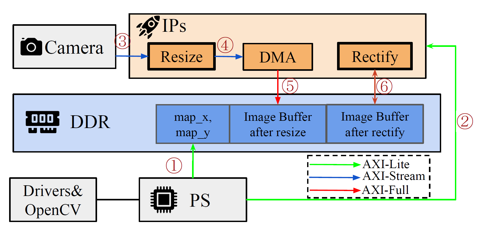
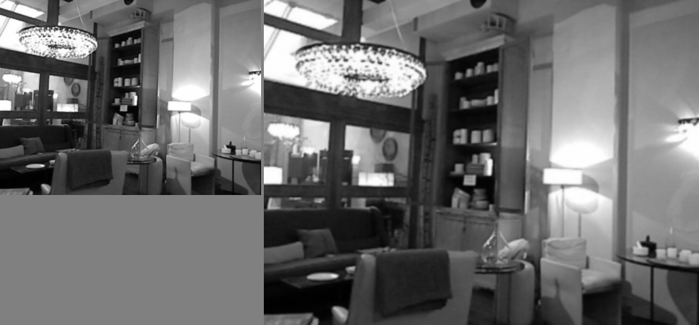
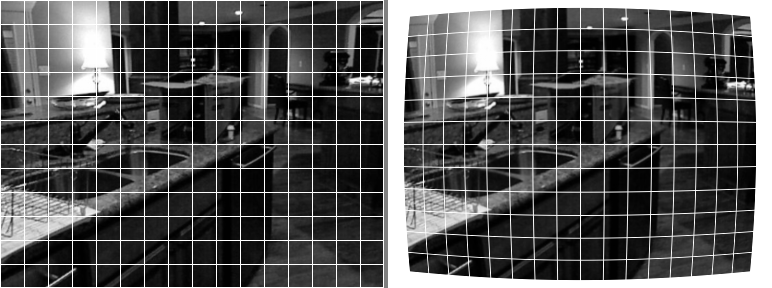

# Real-Time ROS 2 Camera Preprocessing Accelerator

This project include two Vitis HLS image-processing kernels for the AMD ROS 2 Perception Node pipeline: bilinear `resize_kernel` and map-based `rectify_kernel`. The motivation is to **offload simple but heavy image processing computation from PS to IP**, thus allow PS to perform real-time downstream perception tasks such as object detection, SLAM, and visual odometry without being bottlenecked by per-pixel preprocessing.

The overall architechture is shown in below figure, demostrating the process for our project
1. Initialization: 
    - Step 1: PS compute mapping for `rectify_kernel`, write to memory using AXI-Full
    - Step 2: PS assign IPs register
2. Process Loop: after initialize the system, IPs do following loop iteratively
    - Step 3:  `resize_kernel` read raw data from camera using AXI-Stream and process them
    - Step 4:  `resize_kernel` us AXI-Stream, write the processed image to DMA IP 
    - Step 5: DMA write the data to DDR using AXI-Full
    - Step 6: `rectify_kernel` read/process/write the image using AXI-Full



Our IP processed result is shown in this 2 examples

Example — `nyu_upscale_640x480` (384×288 input on the left, 640×480 bilinear-upscaled output on the right):



Example — `nyu_rectify_barrel_mild` 



On PYNQ-Z2 (`xc7z020` @ 100 MHz) the baseline runs at **≈55 fps for 640×480** (resize 6.1 ms + rectify 12.3 ms ≈ 18 ms / frame) and **≈8 fps for 1080p** (41.5 ms + 82.9 ms); per-resolution latency tables live under each kernel's verification & synthesis section below.

## Codebase overview

```shell
tree -L 1
.
├── hls                          # Vitis HLS C++ kernels, testbenches, build scripts
├── plan.md                      # architecture, motivation, and optimization roadmap
├── README.md                    # this file (build / test / verification reference)
├── requirements.txt             # Python dependencies (numpy, Pillow)
└── sw                           # Python golden model + unit tests + fixture generators
```

### environments and dataset

The Python side (golden model + real-data fixture generation) only needs `numpy` and `Pillow`, pinned in [apply_hardware_design_project/requirements.txt](apply_hardware_design_project/requirements.txt). Any Python ≥ 3.9 works; tested on 3.10.

To install the environments: 
```
python3 -m venv .venv
source .venv/bin/activate            # bash/zsh
# source .venv/bin/activate.csh      # tcsh
pip install -r apply_hardware_design_project/requirements.txt
```

After activation, all `python …` commands in this README use that interpreter.

We use [nyu_depth_v2](https://cs.nyu.edu/~fergus/datasets/nyu_depth_v2.html) as test data — the 384×288 preprocessed RGB derivative of the NYU V2 labeled split (795 train / 654 test images), stored under [apply_hardware_design_project/archive/data/nyu_real/](apply_hardware_design_project/archive/data/nyu_real/).

### data preprocessing and testcase build


Both kernels feed their HLS C-testbenches the same way: NYU PNG → `PIL.Image.convert("L")` 8-bit grayscale → headerless `.bin` files (one byte per pixel, row-major, no header). For each dataset, we use bit level assertation and visualization([apply_hardware_design_project/sw/vis/](apply_hardware_design_project/sw/vis/) to check it's correctness.

**Resize fixtures.** Five fixed cases generated by [sw/prepare_real_data.py](apply_hardware_design_project/sw/prepare_real_data.py), checked bit-exactly against the Python golden `resize_vectorized`:

| case | input | output | coverage |
|---|---|---|---|
| `nyu_downscale_320x240` | 384×288 | 320×240 | non-integer down |
| `nyu_half`              | 384×288 | 192×144 | clean 2× down |
| `nyu_upscale_640x480`   | 384×288 | 640×480 | non-integer up |
| `nyu_identity`          | 384×288 | 384×288 | no-op smoke test |
| `nyu_square_96`         | 384×288 | 96×96   | both axes stretched |

Per-case files: `<case>_in.bin` (input grayscale bytes), `<case>_gold.bin` (Python golden output), plus a line in `cases.txt` that the testbench reads to drive the run. Pair PNGs land in `sw/vis/<case>_pair.png` (input | output, eyeball check for border artifacts and aliasing).


**Rectify fixtures.** Five real-image cases generated by [sw/prepare_real_rectify_data.py](apply_hardware_design_project/sw/prepare_real_rectify_data.py), each with its own remap table, checked bit-exactly against `rectify_vectorized`:

| case | input | output | map | coverage |
|---|---|---|---|---|
| `nyu_rectify_identity`     | 384×288 | 384×288 | `(x, y)`                                  | rectify ≡ copy (smoke) |
| `nyu_rectify_shift_frac`   | 384×288 | 384×288 | `(x+0.25, y+0.50)`                        | fractional shift / bilinear interp |
| `nyu_rectify_crop_192x144` | 384×288 | 192×144 | `(x+96, y+72)`                            | integer-offset sub-window |
| `nyu_rectify_zoom_2x`      | 384×288 | 384×288 | half-pixel-per-output centre-zoom         | non-trivial scale map |
| `nyu_rectify_barrel_mild`  | 384×288 | 384×288 | `c + (1 + k·r²)·(x − c)`, `k = 0.10`      | radial distortion + edge clamp |

Per-case files: `<case>_in.bin` (uint8 input), `<case>_map_x.bin` + `<case>_map_y.bin` (float32 remap tables, row-major), `<case>_gold.bin` (uint8 output), plus a line in `rectify_cases.txt`. The barrel case is the canonical "lens-distortion correction" use-case for a robotics rectify pipeline; pair PNGs in `sw/vis/nyu_rectify_*_pair.png` show the warped output against the original frame.


> **Cosim caveat (rectify only):** the real-data tier runs in C-sim only. Vitis HLS's `m_axi` pointer wrapper segfaults on the 384×288 buffers during C/RTL co-simulation, so `run_rectify_hls.tcl` sets `RECTIFY_TB_SKIP_REAL_DATA=1` before `cosim_design` and the cosim phase runs the 5 synthetic cases only. C-sim already validates Python-golden ↔ HLS-top-level math bit-exact across the 5 NYU cases; cosim's job is RTL ↔ C equivalence, which the synthetic cases cover.


## resize_kernel

`resize_kernel` performs bilinear downscale or upscale on a streaming image. The HLS C++ kernel ([hls/resize.cpp](apply_hardware_design_project/hls/resize.cpp)) and the Python golden ([sw/resize.py](apply_hardware_design_project/sw/resize.py)) share the same `u = sₓ·x, v = sᵧ·y` formulation (no half-pixel centering, see [plan.md](apply_hardware_design_project/plan.md)) in **float32**, so the C-testbench `memcmp`s outputs bit-exactly against the Python golden — no tolerance windows.

### python golden model

[sw/resize.py](apply_hardware_design_project/sw/resize.py) is the reference implementation, every arithmetic step in float32. Three entry points:

- `bilinear_sample(img, u, v)` — single-sample helper, border-clamped to `[0, W−1] × [0, H−1]`.
- `resize(img, out_h, out_w)` — plain double loop; maps 1:1 to the HLS schedule and is the easiest path for line-by-line comparison against an HLS C-sim trace.
- `resize_vectorized(img, out_h, out_w)` — same math, numpy-vectorized; used by `prepare_real_data.py` to generate the real-data goldens documented in [data preprocessing](#data-preprocessing-and-testcase-build).

Run the unit tests (loop vs vectorized bit-exact, identity, shapes, hand-computed 2×2, OpenCV cross-check if installed):

```
python apply_hardware_design_project/sw/test_resize.py
```

### files

- [hls/resize.h](apply_hardware_design_project/hls/resize.h) — top-level declarations, `pixel_t = ap_uint<8>`, `dim_t = ap_uint<13>` (≤ 8191), compile-time bounds `RESIZE_MAX_IN_W/H`, `RESIZE_MAX_OUT_W/H` (default 1920×1080).
- [hls/resize.cpp](apply_hardware_design_project/hls/resize.cpp) — `resize_kernel(...)`, the synthesizable top.
- [hls/resize_tb.cpp](apply_hardware_design_project/hls/resize_tb.cpp) — self-contained C-testbench: 5 synthetic cases + every case listed in `testdata/cases.txt`.
- [hls/run_hls.tcl](apply_hardware_design_project/hls/run_hls.tcl) — Vitis HLS build/flow script (csim / csynth / cosim).
- [hls/testdata/](apply_hardware_design_project/hls/testdata/) — real-image `.bin` fixtures produced by `sw/prepare_real_data.py`.

### interface

```
void resize_kernel(
    hls::stream<pixel_t> &in_stream,   // AXI-Stream, row-major uint8 pixels
    hls::stream<pixel_t> &out_stream,  // AXI-Stream, row-major uint8 pixels
    dim_t in_w, dim_t in_h,            // AXI4-Lite (bundle=ctrl)
    dim_t out_w, dim_t out_h,
    float scale_x, float scale_y);     // pre-computed by PS: in_*/out_*
```

- **Data plane**: two `axis` ports — one input stream, one output stream, one 8-bit pixel per beat. Fits directly between a DMA source and a DMA sink in a Zynq streaming pipeline.
- **Control plane**: all dims and scale factors are `s_axilite` in a single `ctrl` bundle, plus the standard `return` register (ap_start / ap_done / ap_idle / ap_ready). `scale_x/y` are passed as pre-divided `float` so the kernel does **not** synthesize a divider — the PS computes `in_w/out_w` once per frame config.

### coordinate & math (matches the golden exactly)

For every output pixel `(x, y)`:

```
u = clamp(scale_x * x, 0, in_w − 1)
v = clamp(scale_y * y, 0, in_h − 1)
u0 = (int)u,  u1 = min(u0+1, in_w−1)
v0 = (int)v,  v1 = min(v0+1, in_h−1)
du = u − u0,  dv = v − v0
out = clamp(Σ w_ij · p_ij, 0, 255) truncated to uint8
```

All arithmetic is IEEE-754 `float`. The clamp-on-address trick (rather than replicating samples) means the last column/row never triggers out-of-range BRAM reads. Output packing uses `(uint8_t)(int)acc` — integer truncation, same as numpy's `astype(uint8)` after `np.clip` in the Python golden.

### schedule — 2-row ring buffer, II=1

Because `v = scale_y · y` is **monotonic non-decreasing** in `y`, any output row needs only two consecutive input rows: `v0` and `v0+1`. So a `pixel_t line_buf[2][RESIZE_MAX_IN_W]` suffices — no full-frame storage.

```
for r in 0..in_h−1:
    LOAD_ROW: stream in row r into line_buf[r & 1][:]        # II=1
    EMIT: while next_y < out_h and v1(next_y) ≤ r:
        compute row-constant (v_f, v0, v1, dv, row slots)
        EMIT_PIXEL: for xo in 0..out_w−1:                    # II=1
            compute (u_f, u0, u1, du)
            fetch 4 taps from line_buf[row0_slot/row1_slot]
            write bilinear(...) to out_stream
        next_y++
```

Key pragmas ([resize.cpp:65-77](apply_hardware_design_project/hls/resize.cpp#L65-L77), [resize.cpp:104-106](apply_hardware_design_project/hls/resize.cpp#L104-L106)):

- `ARRAY_PARTITION line_buf dim=1 complete` — the two-row dimension is fully split so both tap rows are read in the **same cycle** → 2×2 neighborhood at II=1.
- `BIND_STORAGE line_buf type=ram_t2p impl=bram` — true dual-port BRAM: write (from LOAD_ROW) and read (from EMIT_PIXEL) can happen concurrently; on a single BRAM this would cost 1 extra cycle per pixel.
- `PIPELINE II=1` on both `LOAD_ROW` and `EMIT_PIXEL` → steady-state throughput is **1 pixel/cycle** on both the input load and output emit phases.
- `LOOP_TRIPCOUNT` on every bounded-dynamic loop so Vitis HLS reports meaningful latency with the `RESIZE_MAX_*` bounds.

Fast-path correctness argument: after streaming in row `r`, any output row `y` with `v1(y) ≤ r` is serviceable (both taps in `line_buf`), and because `v` is monotonic in `y` we can drain them greedily in order without ever needing an old row again. Each input row is therefore read **once** from the AXI-Stream, and each output pixel written **once** — no backpressure loops, no slow path.

### testbench

[hls/resize_tb.cpp](apply_hardware_design_project/hls/resize_tb.cpp) runs **two tiers** and fails on any byte mismatch:

1. **Synthetic cases** ([resize_tb.cpp:235-239](apply_hardware_design_project/hls/resize_tb.cpp#L235-L239)) — deterministic `rand()` images for 5 shape regimes (downscale / upscale / identity / non-integer / wide-skinny). The golden is the in-file `golden_resize()` — a straight C++ port of `sw/resize.py` with the same float32 order of ops.
2. **Real-data cases** — `find_testdata_dir()` walks a few candidate paths so the tb works both from `hls/` directly and from Vitis's deep `csim/build` cwd. Then it reads `testdata/cases.txt`, streams each `_in.bin` through `resize_kernel`, and `memcmp`-s against `_gold.bin` (produced by the Python `resize_vectorized`). If `cases.txt` is missing the real-data phase is skipped with a warning — the synthetic cases still run.

Every case prints a single `PASS (…)` or `FAIL (…): N mismatches, max|diff|=…, first (y,x) hw=… gold=…` line, and the driver exits non-zero if any case fails.

### build / run

From [apply_hardware_design_project/hls/](apply_hardware_design_project/hls/):

```
vitis_hls -f run_hls.tcl            # csim + csynth + cosim
vitis_hls -f run_hls.tcl csim       # C simulation only
vitis_hls -f run_hls.tcl csynth     # C synthesis only
vitis_hls -f run_hls.tcl cosim      # RTL/C co-simulation (needs csynth first)
```

Target in the script is `xc7z020clg400-1` (Zynq-7020 on PYNQ-Z2) at a **10 ns** clock — adjust `PART` / `PERIOD` in [run_hls.tcl](apply_hardware_design_project/hls/run_hls.tcl) for a different board. The project tree is written to `hls/resize_hls/sol1/`; synthesis and cosim reports land under `sol1/syn/report/` and `sol1/sim/report/`.

Before running cosim with real images, regenerate the fixtures once:

```
python apply_hardware_design_project/sw/prepare_real_data.py
```

### verification & synthesis

| phase | result |
|---|---|
| Python golden tests ([sw/test_resize.py](apply_hardware_design_project/sw/test_resize.py)) | 5/5 PASS (loop ≡ vectorized bit-exact, identity, shapes, hand-computed 2×2, OpenCV cross-check skipped when `cv2` absent) |
| HLS C-simulation (synthetic) | `downscale` / `upscale` / `identity` / `non-integer` / `wide` — 5/5 PASS |
| HLS C-simulation (NYU real-data) | `nyu_downscale_320x240` / `nyu_half` / `nyu_upscale_640x480` / `nyu_identity` / `nyu_square_96` — 5/5 PASS, byte-exact against `_gold.bin` from `resize_vectorized` |
| HLS C-synthesis | completes; top-module slack reported as `−0.70 ns` at 10 ns target (EMIT_PIXEL pipeline; closes ≈93 MHz) |
| HLS C/RTL co-simulation | 10/10 PASS (both tiers); max `hls::stream` depth = 307,200 (= 640×480, largest real-data case) |

Resource estimates from `hls/resize_hls/sol1/syn/report/csynth.rpt` (target `xc7z020clg400-1` @ 10 ns):

| resource | usage | % of part |
|---|---|---|
| BRAM | 2     | ~0% |
| DSP  | 37    | 16% |
| FF   | 4,852 | 4%  |
| LUT  | 8,699 | 16% |

**Reading the table.** The shape — **DSP and LUT both ≈ 16 %, BRAM near-zero, FF moderate** — is the classic fingerprint of a **compute-bound streaming float32 pipeline**: every output pixel runs ~10 parallel float multiplies (DSP), the float adder / exponent / clamp glue burns LUT, FF banks the 63-stage `EMIT_PIXEL` pipeline, and the only on-chip state is the 2-row line buffer (BRAM, frame-size-independent). DSP and LUT moving together is the float32 tell — going fixed-point would roughly halve both. Resize stays under 20 % on every metric, so ≥ 80 % of `xc7z020` is still free for `rectify_kernel`, DMA, AXI interconnect, and the ROS-side glue.

**Frame latency / throughput on `xc7z020` @ 100 MHz** (steady-state II=1; cycles ≈ `in_h·in_w + out_h·out_w` because both `LOAD_ROW` and `EMIT_PIXEL` run at 1 pixel/cycle):

| in → out                  | cycles  | wall      | throughput |
|---|---|---|---|
| 1920×1080 → 1920×1080     | 4.15 M  | 41.5 ms   | 24 fps     |
| 1280×720  → 1280×720      | 1.84 M  | 18.4 ms   | 54 fps     |
| 640×480   → 640×480       | 614 K   | 6.1 ms    | 163 fps    |
| 384×288   → 384×288       | 221 K   | 2.2 ms    | 450 fps    |

First-pixel-out latency is short (≈ 2 input rows + the 63-cycle `EMIT_PIXEL` iteration latency ≈ 20 µs at 1080p), so downstream consumers see the first pixel long before the frame finishes — useful when chaining into a streaming rectify variant. For asymmetric shapes (e.g. 1080p → 96×96) the input-streaming term `in_h·in_w` dominates and the output is essentially free.

## rectify_kernel

`rectify_kernel` remaps every output pixel `(x, y)` from a source coordinate `(u, v) = (map_x[y, x], map_y[y, x])` supplied by the PS. It reuses the resize stage's bilinear sampler, BORDER_REPLICATE clamp, and uint8 truncation, so the Python golden ([sw/rectify.py](apply_hardware_design_project/sw/rectify.py)) and the HLS kernel ([hls/rectify.cpp](apply_hardware_design_project/hls/rectify.cpp)) share one arithmetic convention end-to-end — the in-file `golden_sample()` in the testbench is a line-by-line port and `memcmp` succeeds with zero tolerance.

### python golden model

[sw/rectify.py](apply_hardware_design_project/sw/rectify.py) reuses `bilinear_sample()` from `resize.py`, so border-clamp and float32 accumulation are inherited unchanged. Four entry points:

- `rectify(img_in, map_x, map_y)` — plain double loop over output pixels; maps 1:1 to the HLS schedule. Returns `img_in.dtype` after `np.clip(0, 255).astype(...)` (truncation, not rounding — matches `(uint8_t)(int)acc` in the kernel).
- `rectify_vectorized(img_in, map_x, map_y)` — same math, numpy-vectorized; used by `prepare_real_rectify_data.py` to generate the real-data goldens documented in [data preprocessing](#data-preprocessing-and-testcase-build).
- `identity_maps(h, w)` — returns `(map_x, map_y)` with `map_x[y, x] = x` and `map_y[y, x] = y`. The rectified output equals the input bit-for-bit.
- `shifted_maps(h, w, dx, dy)` — identity map plus a constant `(dx, dy)` shift. Drives the fractional-pixel tests.

Run the unit tests (identity copy / fractional shape & dtype / border-replicate clamp / hand-computed half-pixel average = 25):

```
python apply_hardware_design_project/sw/test_rectify.py
```

### files

- [hls/rectify.h](apply_hardware_design_project/hls/rectify.h) — top-level declarations, `pixel_t = ap_uint<8>`, `dim_t = ap_uint<13>`, compile-time bounds `RECTIFY_MAX_IN_W/H`, `RECTIFY_MAX_OUT_W/H` (default 1920×1080).
- [hls/rectify.cpp](apply_hardware_design_project/hls/rectify.cpp) — `rectify_kernel(...)`, the synthesizable top.
- [hls/rectify_tb.cpp](apply_hardware_design_project/hls/rectify_tb.cpp) — self-contained C-testbench: 5 deterministic cases, no external fixtures.
- [hls/run_rectify_hls.tcl](apply_hardware_design_project/hls/run_rectify_hls.tcl) — Vitis HLS build/flow script (csim / csynth / cosim).

### interface

```
void rectify_kernel(
    const pixel_t *img_in,             // m_axi gmem_img
    const float   *map_x,              // m_axi gmem_mapx
    const float   *map_y,              // m_axi gmem_mapy
    pixel_t       *img_out,            // m_axi gmem_out
    dim_t in_w, dim_t in_h,            // s_axilite (bundle=ctrl)
    dim_t out_w, dim_t out_h);
```

- **Data plane**: four independent `m_axi` master ports — input image, two `float` remap tables, output image. Each table is sized to `out_w * out_h` and addressed row-major (`y*out_w + x`). Splitting `map_x` / `map_y` / `img_in` / `img_out` onto separate `gmem_*` bundles lets HLS issue their reads in parallel rather than serialize them on one shared port.
- **Control plane**: all dims plus 64-bit base pointers exposed through one `s_axilite` `ctrl` bundle alongside the standard `return` register (`ap_start` / `ap_done` / `ap_idle` / `ap_ready` + `interrupt`).
- Unlike `resize_kernel`, this is a baseline memory-mapped design: no on-chip line buffer, every input tap goes back to DDR through `gmem_img`. The optimized line-buffered + output-queue path with DDR slow-path fallback is described in [plan.md](apply_hardware_design_project/plan.md) and is **not** implemented yet.

### coordinate & math (matches the golden exactly)

For every output pixel `(x, y)`:

```
u = clamp(map_x[y*out_w + x], 0, in_w − 1)
v = clamp(map_y[y*out_w + x], 0, in_h − 1)
u0 = (int)u,  u1 = min(u0+1, in_w−1)
v0 = (int)v,  v1 = min(v0+1, in_h−1)
du = u − u0,  dv = v − v0
out = clamp(Σ w_ij · p_ij, 0, 255) truncated to uint8
```

The clamp-on-address trick handles arbitrary map values (BORDER_REPLICATE) without ever issuing an out-of-range pointer read. Float accumulation order matches the Python golden, so `memcmp` against the testbench gold succeeds bit-exactly with no tolerance window.

### schedule — m_axi-per-pixel baseline, II=4

The kernel is two nested loops with `PIPELINE II=1` requested on the inner body ([rectify.cpp:84](apply_hardware_design_project/hls/rectify.cpp#L84)):

```
OUT_Y:  for y in 0..out_h−1:
OUT_X:    for x in 0..out_w−1:                       # PIPELINE II=1 requested
            idx = y*out_w + x
            u   = map_x[idx]                         # m_axi gmem_mapx
            v   = map_y[idx]                         # m_axi gmem_mapy
            img_out[idx] = bilinear_sample_mem(      # 4 reads on m_axi gmem_img
                img_in, in_w, in_h, u, v)            # + write on m_axi gmem_out
```

Each iteration issues two `float` map reads, four 8-bit image taps, one 8-bit output write, plus the bilinear arithmetic. HLS settles on **II = 4 cycles/pixel** in `csynth.rpt` — the inner loop is bottlenecked by memory dependencies, not by the float chain. No line buffer is instantiated.

For a full 1920×1080 frame the report measures **8,294,471 cycles ≈ 82.9 ms @ 100 MHz** on `xc7z020`. That sustains ~12 fps for full HD; smaller frame sizes scale linearly (e.g. ~14 ms / 70 fps for 640×480). The route to II=1 is the line-buffered + output-queue variant described in `plan.md` (deferred).

### testbench

[hls/rectify_tb.cpp](apply_hardware_design_project/hls/rectify_tb.cpp) runs **two tiers** and fails on any byte mismatch:

1. **Synthetic cases** — 5 deterministic shape regimes built in-file, golden produced by the in-file `golden_sample()` C++ port of `sw/rectify.py`:

| case | in → out | map style | coverage |
|---|---|---|---|
| `identity`      | 32×24 → 32×24 | `(x, y)` | sanity: rectify ≡ copy |
| `fractional`    | 32×24 → 32×24 | `(x+0.25, y+0.50)` | bilinear interpolation path |
| `crop`          | 48×36 → 24×18 | `(x+3, y+2)` | sub-window with integer offset |
| `border_clamp`  | 32×24 → 32×24 | rotating `−5` / `in_w+8` / `in_h+9` / both-OOB | replicate-clamp stress |
| `scale_map`     | 23×17 → 29×11 | half-pixel-centered scale | non-integer in & out dims |

2. **Real-data cases** — 5 NYU 384×288 images driven by the `.bin` fixtures produced by [sw/prepare_real_rectify_data.py](apply_hardware_design_project/sw/prepare_real_rectify_data.py) (identity / fractional shift / crop / centre-zoom / mild barrel — see the [data preprocessing](#data-preprocessing-and-testcase-build) section). The tb `memcmp`s the kernel output against `_gold.bin` from `rectify_vectorized`. Gated by `RECTIFY_TB_SKIP_REAL_DATA` — `run_rectify_hls.tcl` sets this for the cosim phase only, so the real-data tier runs in csim but not cosim (see cosim caveat).

Failures print `errors=N first=I hw=… gold=… max_abs=…` and the driver returns non-zero.

### build / run

From [apply_hardware_design_project/hls/](apply_hardware_design_project/hls/):

```
vitis_hls -f run_rectify_hls.tcl            # csim + csynth + cosim
vitis_hls -f run_rectify_hls.tcl csim       # C simulation only
vitis_hls -f run_rectify_hls.tcl csynth     # C synthesis only
vitis_hls -f run_rectify_hls.tcl cosim      # RTL/C co-simulation (needs csynth first)
```

Target part and clock match the resize project: `xc7z020clg400-1` @ **10 ns** (PYNQ-Z2), configurable via `PART` / `PERIOD` in [run_rectify_hls.tcl](apply_hardware_design_project/hls/run_rectify_hls.tcl). The build tree lands under `hls/rectify_hls/sol1/`; synthesis reports under `sol1/syn/report/`, cosim logs under `sol1/sim/report/`.

### verification & synthesis

Latest verified state (`xc7z020` @ 10 ns): csim **10/10 PASS** (5 synth + 5 NYU real-data), csynth completes with **slack 0.00 ns** (clean), cosim 5/5 PASS (synth only — the real-data tier is skipped via `RECTIFY_TB_SKIP_REAL_DATA`, see the [data preprocessing](#data-preprocessing-and-testcase-build) cosim caveat). Resource estimates from `csynth.rpt`:

| resource | usage | % of part |
|---|---|---|
| BRAM | 12    | 4%  |
| DSP  | 13    | 5%  |
| FF   | 7,508 | 7%  |
| LUT  | 9,623 | 18% |

The fingerprint **flips versus resize**: BRAM ↑ (line / burst buffers for the 4 `m_axi` ports), DSP ↓ (II = 4 lets HLS time-share multipliers across 4 cycles instead of laying them out in parallel), LUT comparable (float32 glue dominates either way). Same bilinear math, opposite hardware shape — that's the streaming-vs-memory-mapped architecture choice showing up in numbers.

**Frame latency / throughput on `xc7z020` @ 100 MHz** (II=4, memory-bound; cycles = `4 · out_h · out_w` — fully output-bound):

| in → out                  | cycles  | wall      | throughput |
|---|---|---|---|
| 1920×1080 → 1920×1080     | 8.29 M  | 82.9 ms   | 12 fps     |
| 1280×720  → 1280×720      | 3.69 M  | 36.9 ms   | 27 fps     |
| 640×480   → 640×480       | 1.23 M  | 12.3 ms   | 81 fps     |
| 384×288   → 384×288       | 442 K   | 4.4 ms    | 226 fps    |

The line-buffered + output-queue optimisation in [plan.md](apply_hardware_design_project/plan.md) drops II to 1 — projected 1080p wall-time would fall from 83 ms to ≈ 21 ms (≈ 48 fps, **~4× speed-up**), and 720p would clear 100 fps.

**End-to-end (resize → DDR → rectify, sequential baseline)** — rectify reads its image from DDR, so the two stages can't pipeline through AXI-Stream; resize must fully drain to DDR before rectify starts:

| frame size  | resize  | rectify | total    | composite throughput |
|---|---|---|---|---|
| 1920×1080   | 41.5 ms | 82.9 ms | ≈ 124 ms | ≈ 8 fps   |
| 1280×720    | 18.4 ms | 36.9 ms | ≈ 55 ms  | ≈ 18 fps  |
| 640×480     | 6.1 ms  | 12.3 ms | ≈ 18 ms  | ≈ 55 fps  |
| 384×288     | 2.2 ms  | 4.4 ms  | ≈ 6.6 ms | ≈ 150 fps |

Rectify is the bottleneck across the board. AMD's ROS 2 Perception Node typically runs at 640×480 or 720p where the baseline already clears 18–55 fps — landing the optimised rectify variant takes the 640×480 budget under 8 ms (>120 fps), comfortably real-time for downstream detection / SLAM.
